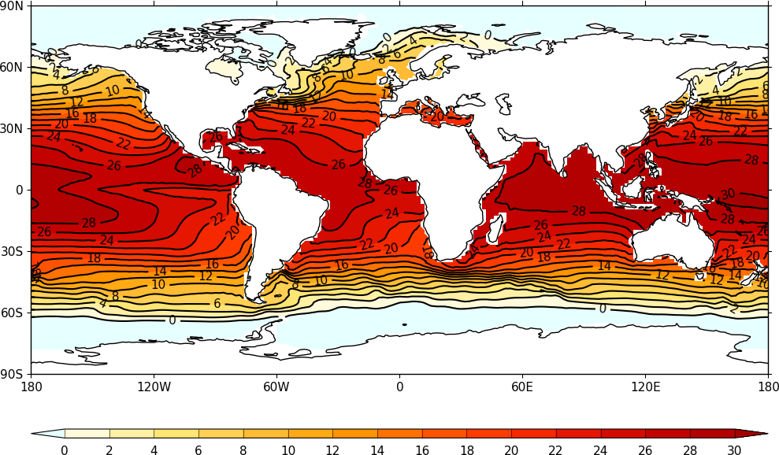

DEVELOPMENT VERSION FOR ``PYTHON 3`` - LIABLE TO CHANGE WITHOUT NOTICE UNTIL THE STABLE RELEASE DATE: ``2019-10-01``
====================================================================================================================

CF Python
=========

The Python cf package is an Earth science data analysis library that
is built on a complete implementation of the CF data model

Documentation
=============

http://ncas-cms.github.io/cf-python

Installation
============

http://ncas-cms.github.io/cf-python/installation.html

Functionality
=============

The `cf` package implements the CF data model
(https://doi.org/10.5194/gmd-10-4619-2017) for its internal data
structures and so is able to process any CF-compliant dataset. It is
not strict about CF-compliance, however, so that partially conformant
datasets may be ingested from existing datasets and written to new
datasets. This is so that datasets which are partially conformant may
nonetheless be modified in memory.

A simple example of reading a field construct from a file and
inspecting it:

    >>> import cf
    >>> f = cf.read('file.nc')
    >>> print(f)
    Field: air_temperature (ncvar%tas)
    ----------------------------------
    Data            : air_temperature(time(12), latitude(64), longitude(128)) K
    Cell methods    : time(12): mean (interval: 1.0 month)
    Dimension coords: time(12) = [0450-11-16 00:00:00, ..., 0451-10-16 12:00:00] noleap
                    : latitude(64) = [-87.86380004882812, ..., 87.86380004882812] degrees_north
                    : longitude(128) = [0.0, ..., 357.1875] degrees_east
                    : height(1) = [2.0] m

The `cf` package can:

* read field constructs from netCDF, PP and UM datasets,
* create new field constructs in memory,
* inspect field constructs,
* test whether two field constructs are the same,
* modify field construct metadata and data,
* create subspaces of field constructs,
* write field constructs to netCDF datasets on disk,
* incorporate, and create, metadata stored in external files,
* read, write, and create data that have been compressed by convention
  (i.e. ragged or gathered arrays), whilst presenting a view of the
  data in its uncompressed form,
* Combine field constructs arithmetically,
* Manipulate field construct data by arithmetical and trigonometrical
  operations,
* Perform statistical collapses on field constructs,
* Regrid field constructs,
* Apply convolution filters to field constructs,
* Calculate derivatives of field constructs,
* Create field constructs to create derived quantities (such as
  vorticity).

Visualization
=============

Powerful, flexible, and very simple to produce visualizations of field
constructs are available with the `cfplot` package
(http://ajheaps.github.io/cf-plot), that needs to be installed
seprately to the `cf` package.

See the cf-plot gallery
(http://ajheaps.github.io/cf-plot/gallery.html) for the full range
range plotting possibilities with example code.

Command line utilities
======================

During installation the ``cfa`` command line utility is also
installed, which

* generates text descriptions of field constructs contained in files,
  and

* creates new datasets aggregated from existing files.

Tests
=====

Tests are run from within the ``cf/test`` directory:

    python run_tests.py
